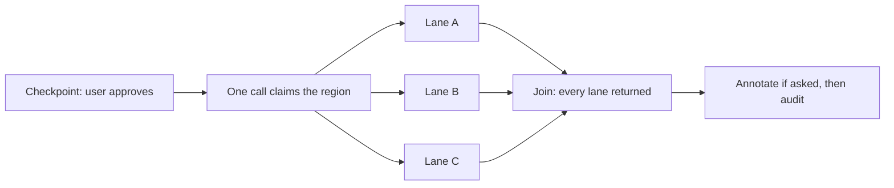

# Writing to Figma in parallel

Every write path in this skill decomposes the same way. One call claims a region
of canvas and hands back ids; several calls then fill disjoint parts of it.
Generating a screen fills its sections, annotating fills its cards, and the kit
captures in [../scripts/extract.md](../scripts/extract.md) read one page per
call. The shape is the same each time and so is the single property that makes it
safe — which is why both are stated here rather than re-argued on every page that
writes. The reasoning used to live in [generate.md](generate.md) alone, so the
annotate pass, the re-issue path, and the captures each got a passing mention of
"in parallel" with no invariant attached to it.

What varies between hosts is smaller than it looks. Both Cursor and Claude Code
emit several tool calls in one assistant message, so that rung is universal; what
actually differs is whether there is a subagent layer above it and whether a
subagent inherits the Figma MCP server. None of it bears on correctness. **The
ladder below decides how fast the same writes land, never which of them are
allowed** — a run that dropped to the floor produces the same file, and nothing
in this skill is satisfiable only by going faster.

## The invariant

**No lane scans the canvas, positions a top-level node, or touches a node
outside the subtree it was handed.** Lanes write to disjoint subtrees, so they
cannot collide with each other or with work that was already on the page. The
moment one reaches outside — to find a node by name across the page, to place
something beside the frame — the guarantee is gone and the writes go back to
running one after another.

That is the whole safety argument, and it is worth noticing how little it
assumes. Nothing about locking, nothing about ordering, and nothing about what
Figma does with two scripts that arrive together. Disjointness is a property of
the scripts themselves, so it is established by reading them before either one
runs rather than by observing what happened after. `use_figma` is atomic on top
of that: a script that throws executes nothing, so a failed lane leaves no
partial node behind for another lane to trip over.

**Disjoint subtrees is not the same as disjoint effects.** Two lanes appending
into one auto-layout column never touch each other's nodes and still collide,
because what they share is the column's child order — and order is the one piece
of state a parent holds on its children's behalf. Whichever call ran second
appends second, and neither script knows which one that was. So a container whose
members are ordered and arrive from more than one lane gets claimed and populated
by the skeleton rather than raced for by the lanes.
[annotate.md](annotate.md#filling-the-cards-in-parallel) is where this bites, and
it is the reason the annotate pass has a skeleton at all.

### One ordered container, one writing lane

The thing that makes the column above unsafe is two writers on one ordered
container, not the ordering by itself. Order is state the parent holds, and state
only needs arbitrating when more than one script is changing it. A lane creating
children inside a container no other lane touches has no second appender to order
against: whatever sequence it produces is the sequence it wrote, in the order its
own script wrote it, and there is no other call whose position in that sequence it
would have to know.

So the rule reads in both directions rather than only against the lanes. A
container fed by several lanes is claimed and populated by the skeleton.
A container owned by exactly one lane can be built by that lane, children and
all, and doing so races with nothing. Ownership is what carries the guarantee
here, exactly as disjointness does above — established by reading the lanes
before either runs, rather than observed afterwards.

## Skeleton then fill

One call claims the region and returns ids; N lanes fill disjoint subtrees inside
it. This is the general shape rather than a generate-only trick, and the two
halves are not interchangeable. Claiming canvas is exactly the top-level
positioning [the invariant](#the-invariant) forbids a lane from doing, and the
ids a lane pastes in as string literals do not exist until something has claimed
it. A run with no skeleton has no way to hand a lane a subtree, so it has no
lanes.



The checkpoint sits before the skeleton rather than before the lanes, because the
skeleton is the call that duplicates the frame — it is the first thing on the
diagram the user has to have agreed to, and where it lands is one of the two
things they were asked
([generate.md](generate.md#the-checkpoint-is-one-call-with-two-questions)).

**What the skeleton returns is the whole interface between the two halves.** A
page id, so the lane can switch to it; one id per subtree, so the lane can reach
its own and nothing else; and any name, index, or order the lane would otherwise
have to work out for itself. Anything missing from that return is something a
lane will go looking for, and a lane that goes looking is a lane that broke the
invariant.

## The ladder

**Take the strongest rung the host offers *and* the work justifies.** A decision
rule rather than a preference, because the top rung is not free and the middle
one already collects the win.

- **Batched tool calls in one message** — the default. Issuing N calls in one
  message removes N-1 model round trips, and the round trips are where the time
  goes. It does not depend on Figma running the scripts concurrently: even fully
  serialized on that side, the saving is intact.
- **Subagents** — only when the decomposition is larger than one message of
  lanes carries well. More than about six lanes, a multi-screen run, or lanes
  that each need their own catalog lookups and copy decisions rather than one
  prepared script. This rung requires the subagent to inherit the Figma MCP
  server; when it does not, drop a rung, because a subagent that cannot call
  `use_figma` is not a lane. Whether Cursor's subagents inherit it is untested —
  treat that as an open question to settle by running one lane from a subagent,
  rather than as a host difference this page has already established.
- **Sequential** — the floor. Identical output, slower, and where all of this
  goes the moment a lane would have to reach outside its own subtree to do its
  job.

A subagent costs a prompt, a context, and a join, and spending all three on four
lanes of already-written script is slower than the single message it replaced.
That is the ordinary case: most runs are three to six lanes and belong on the
middle rung. The top rung earns its overhead when each lane has thinking to do
that the message issuing it would otherwise have to do first.

**Visible progress is the other thing the rungs differ on, and it points the
opposite way to speed.** On the batched rung the join is free because the message
does not continue until every call has come back — which is the same fact read
from the other side: nothing is visible until everything is, and the user watches
one silence and then a finished screen. The subagent rung is the only one where a
lane lands and reports as it finishes, so a long run shows results accumulating
rather than a wait of unknown length. That does not move the default, because the
saving the middle rung collects is real and most runs are short enough that
nobody is waiting on the first result. It does mean a run whose length is the
complaint has a reason to go up a rung that speed alone would not give it.

### Hard limits on the subagent rung

Three, and each one is a rule this skill already holds that a subagent is the
obvious way to erode.

- **A lane never resolves a destination, never searches for a file, and never
  asks the user anything.** [context.md](context.md#finding-the-page) already
  bans sending a subagent looking, and this rung must not read as the loophole in
  it. A lane arrives with a page id and a subtree id already in hand; anything
  else it needs is something the skeleton should have returned.
- **The checkpoint does not move.** Lanes launch only after the user has approved
  what gets duplicated — [generate.md](generate.md#workflow) step 3. A subagent
  looks like a reasonable place to put "and confirm the target while you are in
  there", and it is the one place that question cannot be asked from: the lane is
  one of N, so either the user is asked N times or the fastest lane answers on
  everyone's behalf.
- **Join before anything reads what the lanes wrote** — below.

### Join before annotating or auditing

**Every lane has to have returned before the next step starts.**
Fire-and-forget is a defect here rather than an optimisation, and the two steps
that follow the lanes are both defeated by it.

The audit reports a node still carrying `placeholder === true` as a defect —
[audit-figma.md](audit-figma.md) — so auditing against a lane that has not
finished invents a failure whose only fix is to have waited. Annotating early
fails more quietly: the
[`Token drift` note](generate.md#one-dev-note-when-something-drifted) is written
from the lanes' returned drift lists, while the audit reads drift back off the
nodes, so a note written before the last lane returned is short exactly the rows
the audit will go on to report. The check that a note exists still passes, which
is what makes it quiet.

On the batched rung the join is free — the message does not continue until every
call has come back, which is part of why that rung costs nothing to adopt. On the
rung above it has to be arranged for.

## The lane contract

Every lane sets up its own world. `figma.currentPage` starts on the file's first
page at the beginning of every call, so a lane opens by switching to the page the
skeleton returned. Nothing else carries either — the imports and the font loads
from the skeleton call went with its scope — so each lane runs
[its own import batch](generate.md#the-imports-go-in-one-batch) and loads its own
fonts. Ids from the skeleton's return get pasted in as string literals; a
variable from an earlier call does not exist here.

```js
const page = await figma.getNodeByIdAsync('0:1');      // pageId, from the skeleton
await figma.setCurrentPageAsync(page);
const mine = await figma.getNodeByIdAsync('12:340');   // this lane's subtree, and no other

// … this lane's import batch, its font load, then its own operations …

mine.placeholder = false;         // clear the shimmer, where the skeleton set one
return { mutatedNodeIds: [mine.id /* , … */], drift };
```

The return value is the other half of the contract. A lane reports the ids it
mutated and every spacing value that snapped, because its caller has no other way
to learn either — the lane's scope ended with its call, which is also why
[the drift record goes on the node](generate.md#the-drift-record-lives-on-the-node)
as well as into the return.

**This is what makes a lane portable.** A lane needing nothing but a page id, a
subtree id, and its own script runs as a tool call or as a subagent without a
word of it changing, so the contract is worth holding on runs that will never
leave the middle rung. A lane that closes over something — a variable from the
skeleton, an import it did not make itself, a question it means to ask later —
works only on the rung it was written for.

## When a lane fails

`use_figma` is atomic: a script that errors executes nothing, so a failed lane
leaves every other lane alone. Where the lane was a single call it also leaves
its subtree exactly as the skeleton left it — no partial nodes and nothing to
clean up, so recovery is re-issuing that lane rather than rebuilding the screen.

**Atomicity is per call, though, and a lane is not always one call.**
[generate.md](generate.md) requires a section needing more than ten logical
operations to split sequentially within its own lane, and
[flows.md](flows.md) says a swim lane "will routinely exceed it — six states at a
label, an instance, and a notes frame apiece is already past twenty". So the
common case is a lane of four or five calls where call three throws and calls one
and two landed. Re-issuing that lane from the top runs the two that succeeded a
second time and duplicates everything they created, so a re-issue is not the
recovery for that shape of failure. This is how a single throw turns into a full
restart: the obvious move makes the section worse, and rebuilding from scratch is
the only remaining move whose result can be predicted.

**A lane that split sequentially repairs from observable canvas state instead.**
Delete the section's children and re-run the lane from its first call. Nothing
new has to be recorded for that to work: what landed is on the canvas, and
emptying the section puts it back into the state the skeleton handed over. The
cost is bounded to one section and never reaches the screen, which is the whole
difference between this and a restart. Where a lane fills named cards the
skeleton created, there is nothing to delete at all — the cards are addressed by
name, so a re-issue that fills only the ones still empty is idempotent by
construction and leaves what landed alone.

Read the error before re-issuing. A failed lane is a script to fix, and a second
identical call fails identically.

**Re-issue the failed lanes together, not one at a time.** The recovery takes the
same shape as the run — N calls in one message. Two lanes that failed on the same
unreachable import are one fix and one message, and re-issuing them in turn
spends a round trip apiece to arrive at the same file.

A lane that failed unnoticed does not reach the handoff looking finished. A node
left carrying `placeholder === true` is a defect the audit reports, so a subtree
nobody filled fails the run instead of passing as done. That check walks the
audited frame, though, so it says nothing about a lane that was filling something
placed beside it — which is the other half of why the join is not optional.
